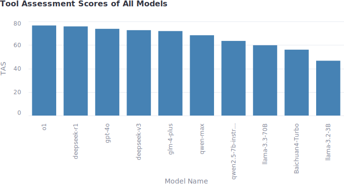

# ToolAssess
***

<!-- TOC -->
* [ToolAssess](#toolassess)
  * [1. 背景](#1-背景)
  * [2. 评估标准](#2-评估标准)
    * [2.1 单任务场景](#21-单任务场景)
      * [2.1.1 工具使用意识](#211-工具使用意识)
      * [2.1.2 工具选择能力](#212-工具选择能力)
      * [2.1.3 单任务工具集选取](#213-单任务工具集选取)
  * [2.2 多任务场景](#22-多任务场景)
    * [2.2.1 工具使用意识](#221-工具使用意识)
    * [2.2.2 工具选择能力](#222-工具选择能力)
  * [3. 综合评价](#3-综合评价)
    * [3.1 评估方法](#31-评估方法)
    * [3.2 综合分数（TAS, Tool Assess Score）](#32-综合分数tas-tool-assess-score)
  * [4. 总结](#4-总结)
    * [4.1 发现的问题](#41-发现的问题)
    * [4.2 评估结果](#42-评估结果)
<!-- TOC -->

## 1. 背景

本研究聚焦于大语言模型（LLM）驱动的智能代理（Agent）在执行任务时的工具规划与选择能力，旨在评估其在实际应用中的效率与可靠性。  

## 2. 评估标准

### 2.1 单任务场景

🔍 **测试任务集**  
在单任务场景中，我精心设计了60个不同的操作（op），每个操作都包含一个用户问题、一个给定工具集和对应的参考结果。  
其中，参考结果可以分为三大类：  
1. 需要工具（requires tool: [tool name]）：代表该任务需要使用某个提供的工具。
2. 不需要工具（no tool）：代表模型不需要任何工具就能完成该任务。
3. 不可能完成（cannot be completed）：代表即使使用提供的工具，模型也无法完成该任务。

下面将在单任务场景下，分别测试[2.1.1 工具使用意识](#211-工具使用意识)和[2.1.2 工具选择能力](#212-工具选择能力)。

#### 2.1.1 工具使用意识

在**单任务场景**下，
评估模型的**工具使用意识**，即测试模型**能否正确分类任务为 "requires tool"、"no tool"、"cannot be completed"**， 
这是一个三分类问题。
测试模型的工具使用意识，通过下面四个指标：

1️⃣ **准确率（Accuracy）**  
✅ 解释  
$$Accuracy=\frac{TP+TN}{TP+TN+FP+FN}$$
 
✅ 现实意义：衡量模型对任务类别判断的准确性，反映模型能否区分任务是否需要工具，即：

能否正确预测任务为 "requires tool"、"no tool"、"cannot be completed"中的哪一种，
但不能区分具体错误类型（如误分类 "requires tool" 为 "no tool"）。  

2️⃣ **精确率（Precision）**  
✅ 解释  
$$Precision=\frac{TP}{TP+FP}$$
 
✅ 现实意义：衡量模型预测某个类别时的可靠性，即：

预测为 "requires tool" 的任务中，有多少实际需要工具？  
预测为 "no tool" 的任务中，有多少实际不需要工具？  
预测为 "cannot be completed" 的任务中，有多少实际无法完成？  
  

3️⃣ **召回率（Recall）**  
✅ 解释  
$$Recall=\frac{TP}{TP+FN}$$
 
✅ 现实意义：衡量在"requires tool"（或"no tool"，"cannot be completed"）的任务中，模型正确预测的比例，即：

所有真正 "requires tool" 的任务中，模型能正确预测多少？  
所有真正 "no tool" 的任务中，模型能正确预测多少？  
所有真正 "cannot be completed" 的任务中，模型能正确预测多少？   

4️⃣ **F1 分数（F1 Score）**  
✅ 解释  
$$F1=\frac{2 * Precision * Recall}{Precision+Recall}$$
 
✅ 现实意义：衡量 模型在精确率（避免误报）和召回率（避免漏报）之间的平衡，即：

如果F1分数很高，说明预测结果既精准又能覆盖大部分样本。  
如果F1分数较低，说明预测结果不够精准或者覆盖不够广。

📌 结论  
✅ 如果关注模型是否能准确识别任务类型，关注 Accuracy  
✅ 如果关注模型预测的误报率，关注 Precision  
✅ 如果关注模型预测的漏报率，关注 Recall  
✅ 如果类别分布不均衡，希望平衡误报率和漏报率的影响，关注 F1 Score  

#### 2.1.2 工具选择能力

🔍 **评估“工具选择能力”**  
由于如果预测结果是"requires tool"，那么具体结果可能是各种各样的工具，所以实际上这是一个多分类问题。
然而，这并不是希望的，因为分类数量取决于出现工具数量，这样不利于评估；
因此，在此基础上，引入两个新类型，分别为"true tool"和"false tool"，
这样，原本的三分类问题变成了["true tool", "false tool", "no tool","cannot be completed"]的四分类问题。  
在**单任务场景**下，
评估模型的**工具选择能力**，即测试模型**能否正确识别出任务需要使用工具，并选择正确的工具"**。  
这不再是一个三分类问题，因为"requires tool"的具体结果可能是各种各样的工具名，事实上，这是一个多分类问题。  
为了简化该问题，我将"requires tool"的分类结果细化为"true tool"和"false tool"，其中"true tool"表示模型预测结果和正确结果都为"requires tool"且工具名相同，"false tool"表示模型预测结果和正确结果都为"requires tool"且工具名不同。  
这样，问题就变成了["true tool", "false tool", "no tool","cannot be completed"]的四分类问题。  
不过，这种定义下，仍然存在一个问题，真实标签中只含有"true tool"而不会含有"false tool"。其后果是：  

1. FN = 0。
2. Recall恒为1。
3. Precision 会偏高。

🔍**类别重映射（Re-mapping Labels）**  
这样的后果当时不是所期望的，因此，做出如下规定：

1. 真实标签和预测标签都为"requires tool"，真实集为"true tool"。如果工具名相同，则预测集为"true tool"；否则，预测集为"false tool"。
2. 真实标签为"requires tool"，预测标签为"no tool"或者"cannot be completed"，则真实集为"true tool"，预测集为"false tool"。
3. 真实标签为"no tool"或者"cannot be completed"，则真实集为"true tool"。如果预测标签为"requires tool"，则预测集为"true tool"，否则预测集为"false tool"。

经过如上规定，问题就变成了["true tool", "false tool"]的二分类问题。  
这样做的好处有：

1. 解决了FN = 0的缺点和Recall恒为1的问题。
2. Precision, Recall, F1 Score 都变得更直观。 
3. 使计算出的指标更具有现实意义。

#### 2.1.3 单任务工具集选取

🔍 **工具集选择**  
我从LangChain和OpenAI的官方文档中，搜集了一些现实世界中的工具，并且简化了其工具描述，简化的描述经过测试，能被大语言模型（gpt-4o）识别出其用途。

🔍 **测试集设计**  
我精心设计了60个不同场景的用户问题，并且难度一次递增。

| 序号    | 测试难度 | 工具数量（个） | 描述                                   |
|-------|------|---------|--------------------------------------|
| 1-5   | 非常简单 | 2       | 几乎无障碍的直接工具选取                         |
| 6-10  | 简单   | 3       | 比较简单,个别测试稍微有干扰                       |
| 11-20 | 一般   | 3       | 均具有一些普通的干扰，稍微存在难度                    |
| 21-30 | 中等   | 3       | 工具选择具有混淆性和重叠性，更考验模型区分工具的能力           |
| 31-40 | 稍微困难 | 4       | 问题有潜在逻辑缺陷或者更强的误导性，部分问题开始考察模型对任务的理解能力 |
| 41-50 | 困难   | 5       | 更复杂，误导性很强，部分问题需要模型挖掘隐藏信息             |


## 2.2 多任务场景

### 2.2.1 工具使用意识

🔍 **评估“工具使用意识”**  
在**多任务场景**下，评估模型的**工具使用意识**，仍然是["requires tool", "no tool", "cannot be completed"]的三分类问题，  
与单任务场景不同的是，模型对每个子任务的回复都与一个特定的场景相关，子任务之间具有逻辑上的联系。  
为了评估这种逻辑上的联系对模型表现的影响，或者说具体场景的影响，我引入了完全正确率和部分正确率这两个指标。  

1️⃣ **完全正确率（ASA, Absolute Scenario Accuracy）**  
✅ 解释  
$$ASA = \frac{\text{Number of scenarios where all sub-tasks are correctly classified}}{\text{Total number of scenarios}}$$  
✅ 现实意义：  
1. 评估模型处理多任务时的一致性，要求模型在整个场景的多个子任务上保持连贯且正确的工具使用判断，从而反映模型在某场景下的决策的准确率。
2. 评估模型对工具使用的可靠性，适用于高度依赖完整性的领域（例如商业分析、医学诊断），这些领域如果一个子任务出错，可能导致整个任务的结果出错。完全正确率能够衡量模型是否在整个工具选择任务流中保持高可靠性，而非要求对所有的子任务保持高准确度。  

2️⃣ **部分正确率（PSA, Partial Scenario Accuracy）**  
✅ 解释  
$$PSA = \frac{1}{N} \sum_{i=1}^{N} \frac{\text{Correct sub-tasks in scenario } i}{\text{Total sub-tasks in scenario } i}$$

✅ 现实意义：  
1. 评估模型使用的普遍意识，与ASA不同，PSA考虑的是总体子任务中的正确率，它反映的是模型整体的决策正确率。
2. 评估模型在一般场景下的可靠性。适用于对完整性依赖不高但是关注决策正确率的领域（例如推荐系统、智能客服），这些领域可以接受部分偏差，只要总体的决策正确率较高，整个任务的完成效果就较好。

### 2.2.2 工具选择能力

🔍 **评估“工具选择能力”**  
与[2.2.1 工具使用意识](#221-工具使用意识)相同，仍然采用ASA和PSA两个指标来评估模型对工具选择的能力。  
这种情况下，将所有的"requires tool"预测结果替换为具体工具名，并计算ASA和PSA。  
ASA仍然考虑的是各场景中的完全正确率，PSA考虑的是总体子任务中的正确率。

## 3. 综合评价

上述研究中已经完成了在两种场景（单任务、多任务）下对两种能力意识（工具使用意识、工具选择能力）的测试，  
于是对于每个测试模型，可以获得四种情况：[情况1](#211-工具使用意识)、[情况2](#212-工具选择能力)、[情况3](#221-工具使用意识)、[情况4](#222-工具选择能力)下的结果。

### 3.1 评估方法

我希望对于每种情况，综合的考量每个测试指标，从而生成对应情况下的评估分数。  
已经完成的评估工作如下表所示：

| 场景类型 | 评估维度   | 指标                             |
|------|--------|--------------------------------|
| 单任务  | 工具使用意识 | Accuracy、Precision、Recall、F1分数 |
| 单任务  | 工具选择能力 | Accuracy、Precision、Recall、F1分数 |
| 多任务  | 工具使用意识 | ASA、PSA                        |
| 多任务  | 工具选择能力 | ASA、PSA                        |

上述一共有**四种测试组合**，下面我们简称为**四种情况**。为了综合考虑每种组合的各个测试指标，以单任务场景下的工具使用意识为例，
展示计算评估分数的过程。 

**🔍计算单任务工具使用意识评分（ST-TUS）**  
计算公式：  
$$ST\text{-}TUA = w_1 \cdot \text{Accuracy} + w_2 \cdot \text{Precision} + w_3 \cdot \text{Recall} + w_4 \cdot \text{F1 Score}$$
其中 $$w_1, w_2, w_3, w_4$$为四个指标的权重，为了选取合适的权重以评估模型的实际表现，
确保评分能够适应不同模型，采取了下的计算策略。  

**🔍自适应权重计算方法**  
方差贡献法（Variance Contribution Method）是一种自适应的权重计算方法。适合于在多个研究指标中动态确定每个指标的
权重，避免人为设置的固定权重影响实验结果精确度。
我收集了每个模型通过上述四种情况下测试的指标，根据该数据进行方差贡献法计算权重，这种方法计算权重的核心思想是：  
1. 如果某个指标的方差较大，说明这个指标对模型的区分度就越明显，因此给予更多权重。
2. 相反，如果某个指标的方差较小，说明这个指标对模型的区分度就越小，因此给予更少的权重。
这样计算出来的权重更能够反映不同模型之间的差距，从而更准确地衡量模型的实际表现。  

**🔍方差贡献法的核心步骤**  
此前，已经对多个模型（gpt-4o、deepseek-r1等）进行了测试，计算这些模型在相同场景下同测试任务中的各指标的方差，
然后计算方差贡献：  
$$W_i = \frac{\text{Var}(X_i)}{\sum \text{Var}(X_j)}$$
其中 $$W_i$$代表第 $$i$$个指标的权重， $$X_i$$代表第 $$i$$个指标在各个模型中的方差。  
通过方差贡献法，可以获得四种情况下的权重因子。于是，可计算出四种情况下的评估分数。


### 3.2 综合分数（TAS, Tool Assess Score）

🔍 **综合分数的计算**

通过方差贡献法计算出了上述四种情况下的评估分数，即  
单任务场景下的工具使用意识分数（tool usage score in single-task scenario, $ST\text{-}TUS$），  
单任务场景下的工具选择能力分数（tool selection score in single-task scenario, $ST\text{-}TSS$），  
多任务场景下的工具使用意识分数（tool usage score in multi-task scenario, $MT\text{-}TUS$）和  
多任务场景下的工具选择能力分数（tool selection score in multi-task scenario, $MT\text{-}TSS$）  

收集到上述结果后，通过下面的公式计算综合分数TAS：  
$$TAS = \alpha \cdot ST\text{-}TUS + \beta \cdot ST\text{-}TSS + \gamma \cdot MT\text{-}TUS + \delta \cdot MT\text{-}TSS$$
其中，权重因子的确定同样可以使用方差贡献法以反映不同模型的表现。

## 4. 总结

### 4.1 发现的问题

1. 测试中发现，模型llama-3.2-3B对提示词（英文）的理解力很差，即使我多次修改规则以适应该模型、规范其格式，其仍然无法完成所有测试。而且该模型的回复格式随机性太强，甚至经常无视提示词的格式要求，
因此我不得不手动修改其数据格式。
2. 工具使用能力和模型规模有一定关系，但是结果中发现规模相对较小的qwen2.5-7b在综合分数和四个具体场景测试中显著高于规模更大的llama-3.3-70B和Baichuan4-Turbo，这说明部分规模较大的模型工具使用能力不足，需要进一步优化。
3. 许多国产模型，例如deepseek的r1和v3、智谱的glm-4表现良好，和业内一流的模型o1与gpt-4o表现比较接近。这是一个很好的现象。

### 4.2 评估结果

通过以上评估方法，对deepseek-r1、gpt-4o等模型进行了综合评估，并计算出其各项分数和综合分数。评估结果如下图：  

  
[各任务评测结果](assets/individual_tasks.csv)

通过运行下面的代码以在浏览器中详细查看测试结果：
```shell
python -m start gpt-4o score
```